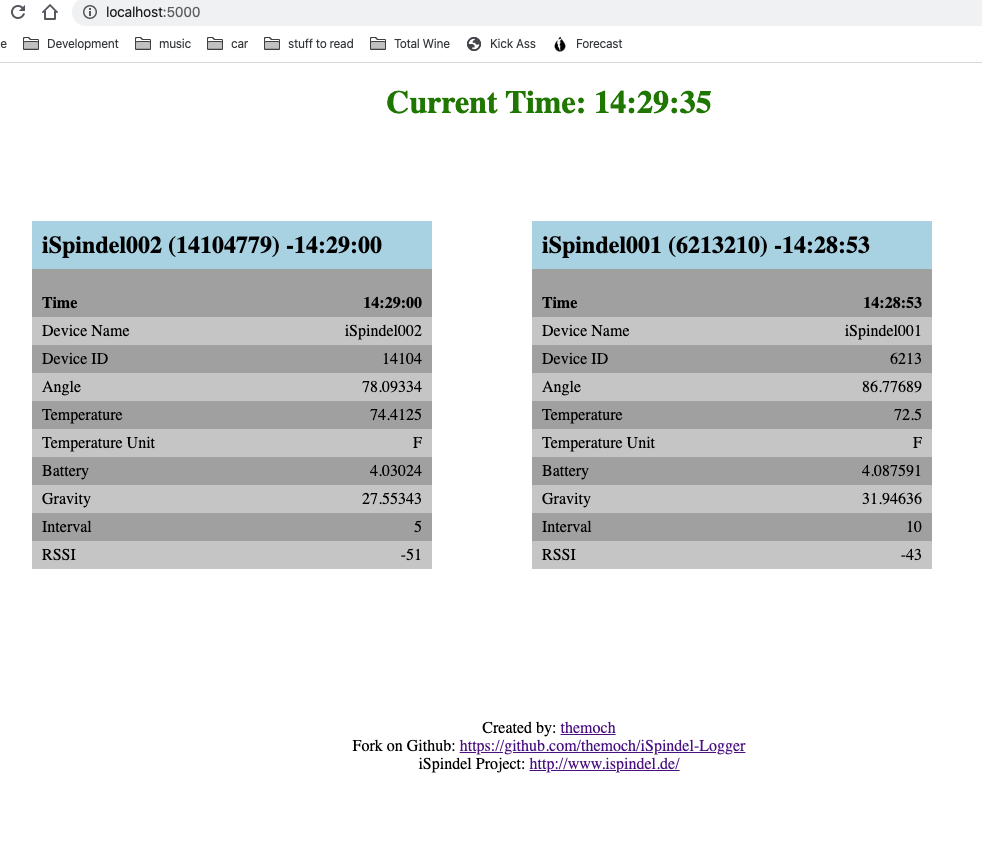
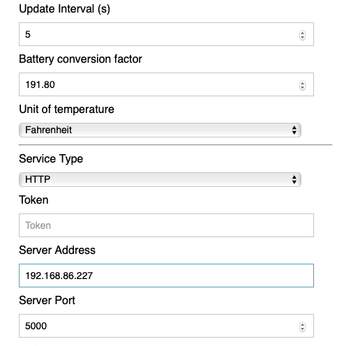

# iSpindel Logger

This is a NodeJs program to view the live data posted from one (or more) iSpindel devices in your browser.



This project was built on top of [simple-react-full-stack](https://github.com/crsandeep/simple-react-full-stack).

- [iSpindel Logger](#ispindel-logger)
  - [Introduction](#introduction)
  - [Quick Start](#quick-start)

## Introduction

In order to calibrate your iSpindel it is required to capture the tilt data while it floats in solution.

Calibration Instructions can be found here: [http://www.ispindel.de/docs/Calibration_en.html](http://www.ispindel.de/docs/Calibration_en.html)

iSpindel Calibration logging tool can be found here: [http://www.ispindel.de/tools/calibration/calibration.htm](http://www.ispindel.de/tools/calibration/calibration.htm)

## Quick Start

1) Get the IP address of your computer: [https://www.howtogeek.com/233952/how-to-find-your-routers-ip-address-on-any-computer-smartphone-or-tablet/](https://www.howtogeek.com/233952/how-to-find-your-routers-ip-address-on-any-computer-smartphone-or-tablet/)

2) Connect to your iSpindel via WiFi and make the following settings:

    
    
    **Update Interval (s):** 5
    
    **Service Type:** HTTP
    
    **Server Address:** %Your IP Address from Step 1%
    
    **Server Port:** 5000 

3) Restart your iSpindel

4) Download, install, and run this program 
```bash
# Clone the repository
git clone https://github.com/themoch/iSpindel-Logger

# Go inside the directory
cd iSpindel-Logger

# Install dependencies
npm install

# Start development server
npm start
```

Your browser will open after the server is up and running.  

After you capture the data, don't forget to change your iSpindel settings back to your desired service type and port.
